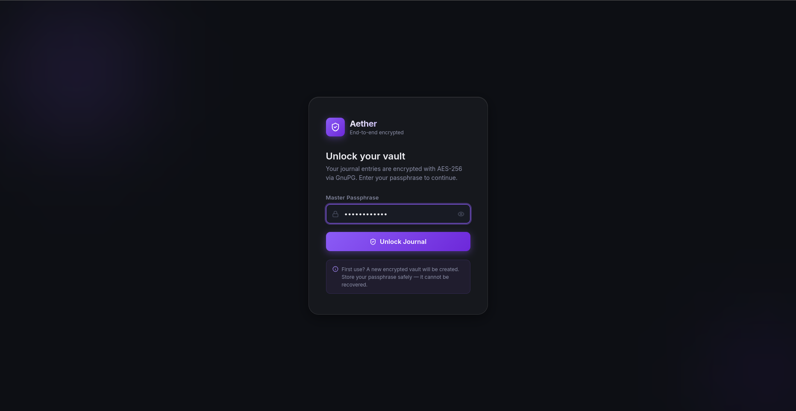
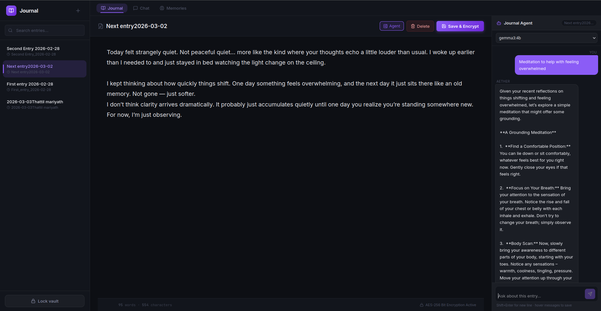
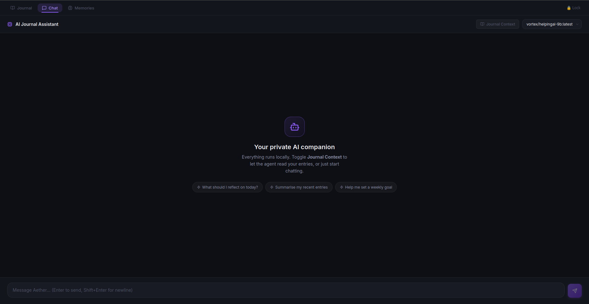
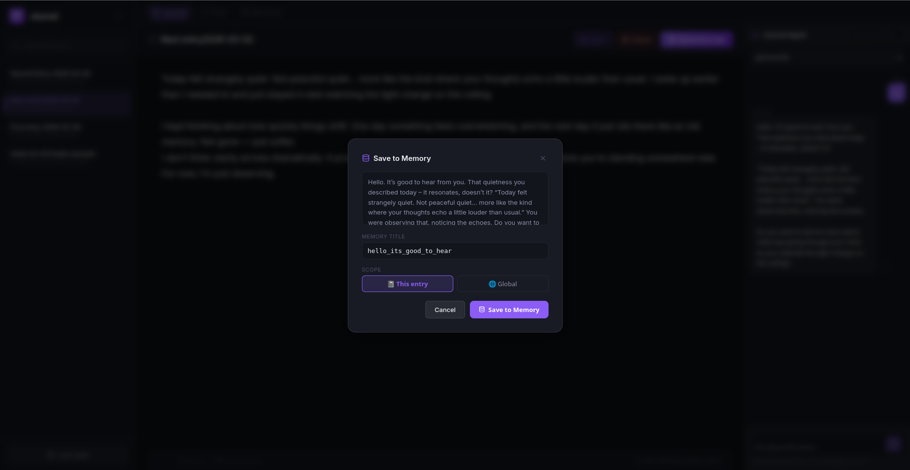

# Aether

A fully encrypted, private journaling application designed to secure your thoughts and data.

## Features

### Encrypted Journaling
Aether provides a secure environment for your personal entries. Every file is fully encrypted on disk using AES-256 symmetric encryption and remains unreadable without your unique passphrase. The password is never written to disk or local storage, ensuring maximum privacy.



### Secure Editor
The core of Aether is a clean, distraction-free editor featuring a premium dark-mode interface. Files are decrypted only in memory when loaded and immediately re-encrypted upon saving. 



### AI Agent Chat
Aether includes an integrated AI agent assistant. This allows you to interact intelligently with your journal entries and ideas directly within the secure environment.



### Memory Management
The Memory feature provides enhanced context and recall capabilities, allowing the application to intelligently reference past ideas and notes while maintaining strict data privacy.



## Architecture Overview

Aether is built using a modern, containerized stack:
- **Backend**: Python and FastAPI utilizing `python-gnupg` for cryptographic operations.
- **Frontend**: React and Vite, delivering a responsive single-page application.
- **Database**: Local file system storage, keeping data resilient as independent, AES-256 encrypted `.gpg` files.
- **Vector Database**: ChromaDB is used to manage and query embeddings for the AI Agent and Memory capabilities.
- **Infrastructure**: Docker Compose with bind mounts for persistent, encrypted file storage on the host machine.

## Getting Started

To launch the application locally, ensure Docker is installed and run the following commands:

```bash
cd Aether/
docker compose up --build
```

Once the containers are running, access the application at: http://localhost:5173
